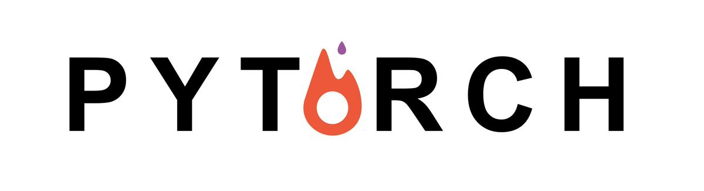

# :construction: This Repository is under construction. I'm currently updating the implementations with PyTorch

# Unity ML-Agents with Pytorch

This repository contains the implementation of deep reinforcement learning algorithms to solve various unity The Environments. The deep reinforcement agents are implemented with the help of PyTorch.

<p align="center"></p>

## Index

- [**Environments**](#Environments)
- [**Installation**](#installation)
- [**Any questions**](#any-questions)
- [**How to help**](#how-to-help)

## Environments

<table>
  <tbody>
    <tr>
        <td>
          
        </td>
        <td>
          <h3>Basic</h3>
          <p>A linear movement task where the agent must move left or right to rewarding states. The goal is to move to the most reward state.</p>
          <p>:file_folder: <a href="./basic">Implementation</a></p>
          <p>:video_camera: <a href="./basic">Video Tutorial</a></p>
        </td>
    </tr>
    </tbody>
</table>


<!-- |  |  |
|  | <h3>Push Block</h3><p>A platforming The Environment where the agent can push a block around. Here the goal is agent must push the block to the goal.</p><p>**:file_folder: [Implementation](./push-block)**</p><p> **:video_camera: [Video Tutorial](.)**</p> |
|  | <h3>Reacher</h3><p>The Double-jointed arm which can move to target locations. Here the goal is agents must move its hand to the goal location, and keep it there.</p><p>**:file_folder: [Implementation](./reacher)**</p><p> **:video_camera: [Video Tutorial](.)**</p> |
|  | <h3>3D Balance Ball</h3><p>A balance-ball task, where the agent balances the ball on its head. Here the goal is agent must balance the ball on its head for as long as possible.</p><p>**:file_folder: [Implementation](./3d-balance-ball)**</p><p> **:video_camera: [Video Tutorial](.)**</p> |
|  | <h3>Grid World</h3><p>A version of the classic grid-world task. Scene contain agent, goal, and obstacles. Here the goal is an agent must navigate the grid to the goal while avoiding the obstacles.</p><p>**:file_folder: [Implementation](./gridworld)**</p><p> **:video_camera: [Video Tutorial](.)**</p> | -->

## Installation

Create a new Python 3.7 The Environment.

```bash
conda create --name unityai python=3.7
activate unityai
```

Clone this repository locally.

```bash
git clone https://github.com/deepanshut041/ml_agents-pytorch.git
cd ml_agents-pytorch
```

Install ml-agents and other dependencies.

```bash
pip install -r requirements.txt
```

Finally, download Environments that correspond to your operating system. Copy/paste the extracted content to the folder with the name of `unity_envs`.

- [Windows (64-bit)](https://drive.google.com/open?id=1yMMMJC4ttS118eqYbr2PpDSpdnyhSoDx)

## Any questions

If you have any questions, feel free to ask me:

- **Mail**: <a href="mailto:squrlabs@gmail.com">squrlabs@gmail.com</a>  
- **Github**: [https://github.com/data-breach/MlAgents](https://github.com/data-breach/MlAgents)
- **Website**: [https://data-breach.github.io/MlAgents](https://data-breach.github.io/MlAgents)
- **Twitter**: <a href="https://twitter.com/deepanshut041">@deepanshut041</a>

Don't forget to follow me on <a href="https://twitter.com/data-breach">twitter</a>, <a href="https://github.com/data-breach">github</a> and <a href="https://medium.com/@data-breach">Medium</a> to be alerted of the new articles that I publish

## How to help  

- **Clap on articles**: Clapping in Medium means that you like my articles. And the more claps I have, the more my article is shared to help them to be much more visible to the deep learning community.
- **Improve our notebooks**: if you found a bug or **a better implementation** you can send a pull request.
